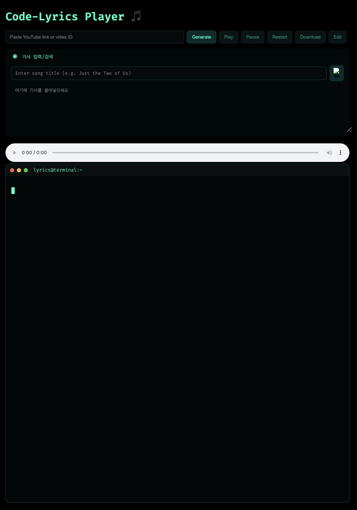
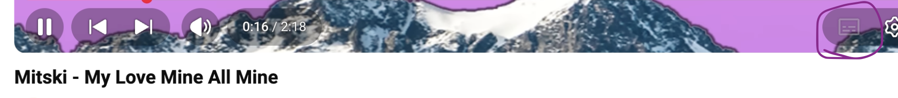
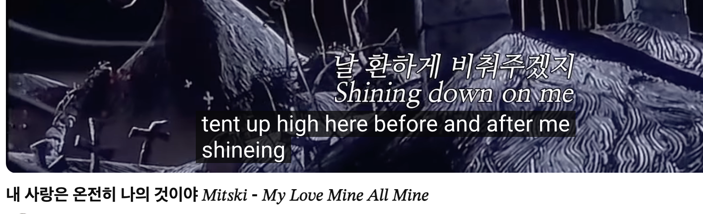
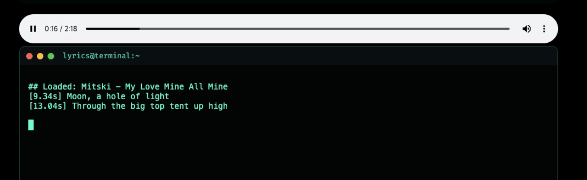
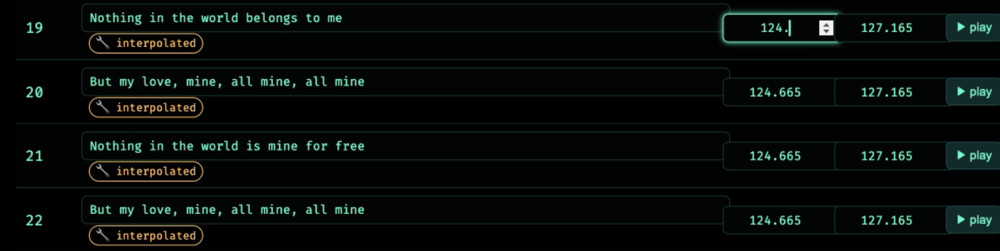

# yt-lyrics

Have you ever seen this on YouTube?

- No subtitles at all for some music videos.
- Subtitles that appear too fast and fragmented to read comfortably.

`yt-lyrics` was built to solve exactly that problem.  
It generates readable, line-synced lyrics from a YouTube link and lets you manually fix mismatches when needed.

## Main Web UI

This is the main website view.



## Why I Built This

For music-heavy videos like *Mine All Mine*, YouTube captions are often unavailable or inconsistent.

### 1) Caption disabled on YouTube

Examples where captions are not available:



### 2) Captions appear too fast ("machine-gun" style)

Even when captions exist, they can be too fragmented and uncomfortable to follow:



## What `yt-lyrics` Does Better

I made this workflow so you can paste a YouTube link + lyrics and get a usable synced result.

### Playback result

Generated lyrics synced in the player:



### Manual correction page

If lyric matching is imperfect, you can edit line timings directly in `/edit`:



## Features

- Download audio from a YouTube URL or video ID
- Isolate vocals with Demucs (`vocals.wav`)
- Transcribe + word-align with WhisperX
- Clean and align user lyrics to line-level timestamps
- Play synchronized lyrics in the web UI
- Manually correct alignment results in `/edit`

## How It Works

1. Input YouTube link
2. Provide lyrics
   - `manual`: paste lyrics (e.g. from Google search)
   - `url`: provide Genius URL
3. Run alignment pipeline
4. Review playback
5. Fix edge cases in `/edit` if needed

## Quickstart (Local)

### Prerequisites

- Python 3.11+
- `ffmpeg` installed on your system

### Install & Run

```bash
python -m venv .venv
source .venv/bin/activate
pip install -r requirements.txt
python app.py
```

Open `http://localhost:3000`.

## Docker

```bash
docker build -t yt-code-lyrics .
docker run --rm -p 3000:3000 yt-code-lyrics
```

Then open `http://localhost:3000`.

## API Overview

- `GET /api/audio`: Resolve streamable YouTube audio URL
- `POST /api/lyrics_timed`: Run full sync pipeline and return line timings
- `GET /api/alignment`: Load saved alignment JSON by `video_id`
- `POST /api/alignment`: Save edited alignment JSON

## Model Strategy and Benchmarking

To keep quality high while controlling runtime/model size, multiple model combinations were benchmarked instead of locking into a single default blindly.

- Notebook: `notebooks/model_combo_benchmark.ipynb`
- Outputs: `benchmark_outputs/`
- Ranking: `benchmark_outputs/section4_ranked.csv`
- Recommendation: `benchmark_outputs/section6_recommendation.md`
- Strategy doc: `docs/model_strategy.md`

### Tradeoff Visualization


## Project Structure

- `app.py`: Flask app + full pipeline orchestration
- `templates/index.html`: main generation/playback UI
- `templates/edit.html`: alignment editor UI
- `static/main.js`: main page frontend logic
- `static/edit.js`: editor page frontend logic
- `downloads/`: runtime JSON/audio outputs
- `demucs_wav/`: separated vocals outputs

## Deployment

- Containerized with `Dockerfile`
- Production server: `gunicorn app:app --bind 0.0.0.0:3000 --workers 2`
- Fly.io config in `fly.toml`

## Notes

- First run may be slow due to model initialization.
- GPU significantly improves WhisperX throughput.