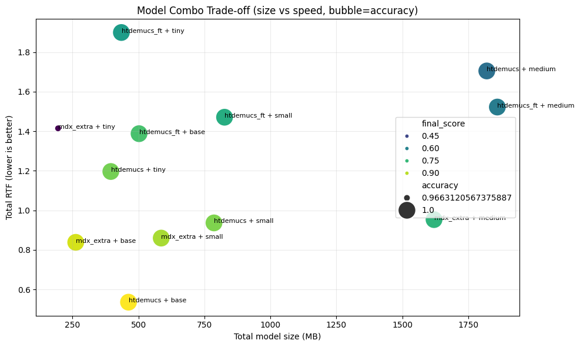

# Model Strategy

This document summarizes how model combinations were selected for `yt-lyrics` based on alignment quality, runtime speed, and model footprint.

## Objective

Pick one practical default pair:

- Source separation model (Demucs family)
- ASR/alignment model (Whisper family)

while balancing:

- `accuracy` (higher is better)
- `total_rtf` (lower is faster)
- `total_model_size_mb` (lower is lighter)

## Scoring Weights

- `w_acc`: `0.5`
- `w_speed`: `0.3`
- `w_size`: `0.2`

## Selected Best Combo

- `demucs_model`: `htdemucs`
- `asr_model`: `base`
- `accuracy`: `1.0`
- `total_rtf`: `0.5356764089514304`
- `total_model_size_mb`: `462.0`
- `final_score`: `0.967927927927928`

## Pareto Candidates

1. `htdemucs + base`
   - `accuracy`: `1.0`
   - `total_rtf`: `0.5356764089514304`
   - `total_model_size_mb`: `462.0`
   - `final_score`: `0.967927927927928`
2. `mdx_extra + base`
   - `accuracy`: `1.0`
   - `total_rtf`: `0.8383246626292342`
   - `total_model_size_mb`: `262.0`
   - `final_score`: `0.9253638386617975`
3. `mdx_extra + tiny`
   - `accuracy`: `0.9663120567375887`
   - `total_rtf`: `1.4146133044699507`
   - `total_model_size_mb`: `195.0`
   - `final_score`: `0.30661791745875805`

## Visual Summary



## Raw Recommendation Payload

```json
{
  "best_combo": {
    "demucs_model": "htdemucs",
    "asr_model": "base",
    "accuracy": 1.0,
    "total_rtf": 0.5356764089514304,
    "total_model_size_mb": 462.0,
    "final_score": 0.967927927927928
  },
  "weights": {
    "w_acc": 0.5,
    "w_speed": 0.3,
    "w_size": 0.2
  },
  "pareto_candidates": [
    {
      "demucs_model": "htdemucs",
      "asr_model": "base",
      "accuracy": 1.0,
      "total_rtf": 0.5356764089514304,
      "total_model_size_mb": 462.0,
      "final_score": 0.967927927927928
    },
    {
      "demucs_model": "mdx_extra",
      "asr_model": "base",
      "accuracy": 1.0,
      "total_rtf": 0.8383246626292342,
      "total_model_size_mb": 262.0,
      "final_score": 0.9253638386617975
    },
    {
      "demucs_model": "mdx_extra",
      "asr_model": "tiny",
      "accuracy": 0.9663120567375887,
      "total_rtf": 1.4146133044699507,
      "total_model_size_mb": 195.0,
      "final_score": 0.30661791745875805
    }
  ]
}
```
